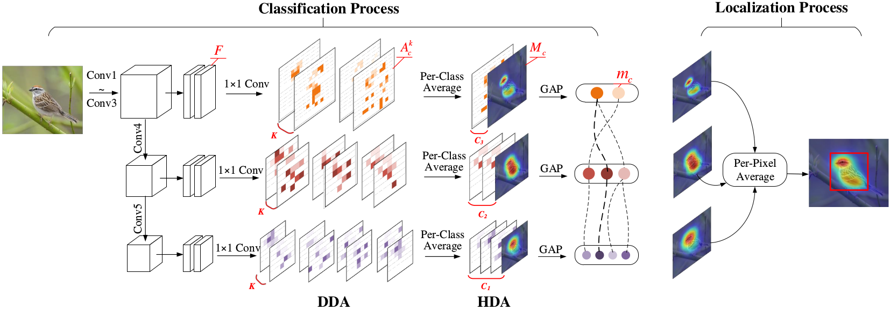
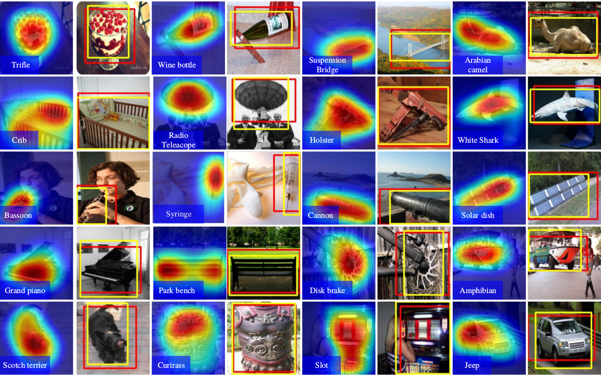
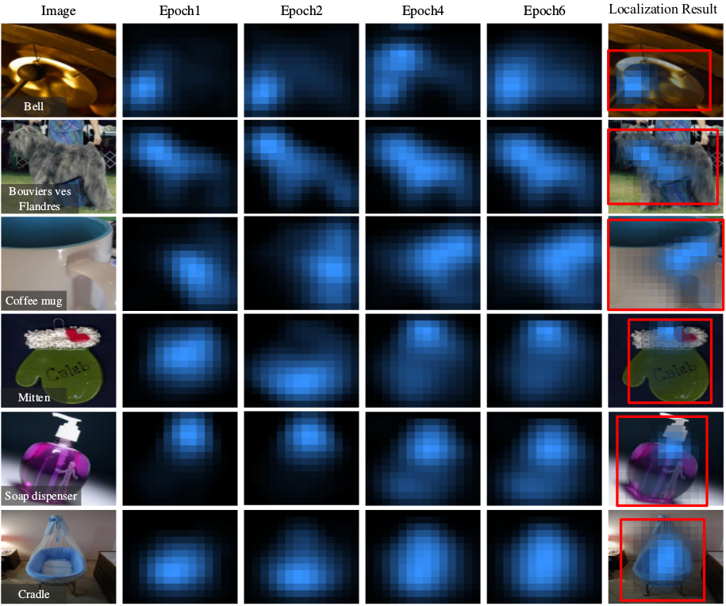

# Overview of DANet


# Train
We finetune the DANet model on the ILSVRC dataset.  
```
cd scripts
sh train_DA_cub.sh
```
# Test
```
cd scripts
sh val_DA_cub.sh
```



### Evolution of the activation maps during training on ILSVRC validation set.

